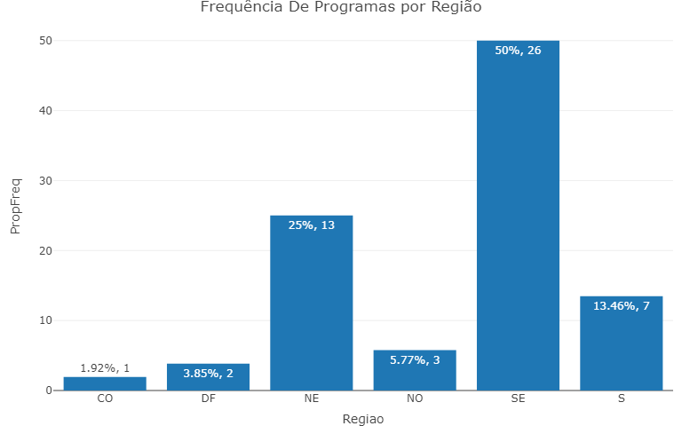
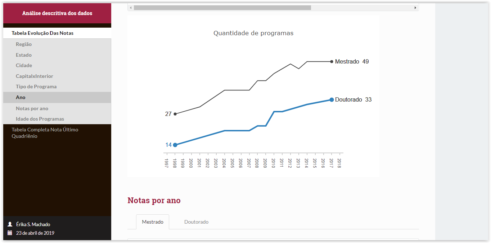

# An evaluation of postgraduate courses in mathematics / probability and statistics through a logistic model

CAPES, foundation of the Ministry of Education (MEC), plays a key role in the expansion and consolidation of postgraduate education in all states of Brazil.
The evaluation of postgraduate national system is responsibility of CAPES and It is an essential activity to ensure and maintain the quality of Masters and 
Doctorate courses in the country. 

The objective is to identify the most relevant variables to achieve program excellence. 
With this study, the Universitys may have direction for the improvement of existing programs.  

  
  
  